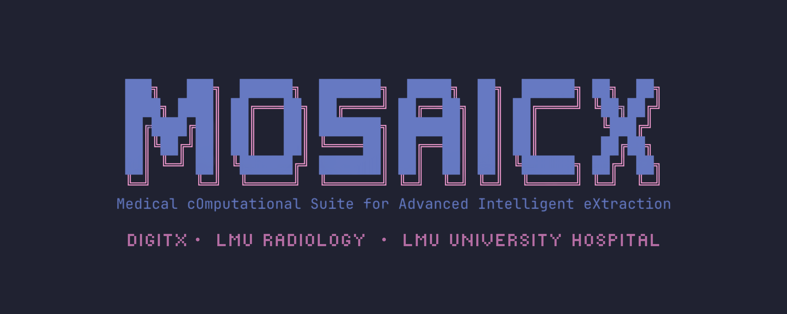

<div align="center">
  
</div>

<p align="center">
  <a href="https://pypi.org/project/mosaicx/"></a>
  <a href="https://doi.org/10.5281/zenodo.17601890"></a>
  <a href="https://www.python.org/downloads/"></a>
  <a href="https://www.apache.org/licenses/LICENSE-2.0"></a>
  <a href="https://pepy.tech/project/mosaicx"></a>
</p>

<p align="center">
  <strong><a href="https://www.linkedin.com/company/digitx-lmu/">DIGIT-X Lab</a> · LMU Munich</strong><br>
  Structure first. Insight follows.
</p>

---

Turn unstructured medical documents (radiology reports, clinical notes, pathology summaries) into validated, machine-readable JSON. Runs locally via Ollama — no PHI leaves your machine.

## Quick start

```bash
# 1. Install Ollama (skip if already installed)
curl -fsSL https://ollama.com/install.sh | sh
ollama serve                    # start the daemon (runs on :11434)

# 2. Pull a model
ollama pull gpt-oss:20b         # fast  — 16 GB RAM
ollama pull gpt-oss:120b        # best  — 64 GB RAM

# 3. Install MOSAICX
pip install mosaicx              # or: uv add mosaicx / pipx install mosaicx

# 4. Verify
mosaicx --version
```

Defaults point to Ollama on localhost — no `.env` needed for local use. See [Configuration](#configuration) to customize.

## What it does

| Command | Purpose |
|---------|---------|
| `mosaicx extract` | Extract structured data from a clinical document |
| `mosaicx batch` | Process a directory of documents in parallel |
| `mosaicx schema generate` | Create a Pydantic schema from a plain-English description |
| `mosaicx schema list` | List saved schemas |
| `mosaicx schema show <name>` | Inspect a schema's fields and types |
| `mosaicx schema refine` | Edit a schema (LLM-driven or manual field ops) |
| `mosaicx summarize` | Synthesize a patient timeline from multiple reports |
| `mosaicx deidentify` | Remove PHI (LLM + regex belt-and-suspenders) |
| `mosaicx template list` | List built-in radiology templates |
| `mosaicx template validate` | Validate a custom YAML template |
| `mosaicx optimize` | Tune a DSPy pipeline (BootstrapFewShot / MIPROv2) |
| `mosaicx config show` | Print current configuration |

Run any command with `--help` for full options.

## Usage examples

### Schema management

Schemas live in `~/.mosaicx/schemas/` as JSON files named after their class (e.g., `EchoReport.json`). Generate, inspect, and refine them entirely from the CLI.

**Generate** — describe what you need in plain English:

```bash
mosaicx schema generate \
  --description "echocardiography report with LVEF, valve grades, impression"

# optionally set the schema name (default: LLM-chosen):
mosaicx schema generate \
  --description "patient name, dob, age, sex, blood pressure" \
  --name PatientVitals
```

**List** saved schemas:

```bash
mosaicx schema list
```

**Refine** — add, remove, or rename fields, or let the LLM restructure:

```bash
mosaicx schema refine --schema EchoReport --add "rvsp: float"
mosaicx schema refine --schema EchoReport --remove clinical_impression
mosaicx schema refine --schema EchoReport --rename "lvef=lvef_percent"

# LLM-driven refinement:
mosaicx schema refine --schema EchoReport \
  --instruction "add a field for pericardial effusion severity as an enum"
```

Generating with the same `--name` (or LLM-chosen name) overwrites the existing file.

### Extract structured data

```bash
mosaicx extract --document report.pdf --template auto
mosaicx extract --document report.pdf --template chest_ct
mosaicx extract --document report.pdf --template ./my_template.yaml
```

### Batch processing

```bash
mosaicx batch \
  --input-dir ./reports \
  --output-dir ./structured \
  --template auto \
  --workers 4 \
  --resume                      # crash-safe checkpointing
```

### Summarize reports

```bash
mosaicx summarize --dir ./patient_001/ --patient P001
mosaicx summarize --document single_report.pdf
```

### De-identify

```bash
mosaicx deidentify --document note.txt                  # LLM + regex
mosaicx deidentify --dir ./notes --regex-only           # regex only, no LLM
mosaicx deidentify --document note.txt --mode pseudonymize
```

## Configuration

All settings live under the `MOSAICX_` prefix. Set them as environment variables or in a `.env` file:

| Variable | Default | Description |
|----------|---------|-------------|
| `MOSAICX_LM` | `openai/gpt-oss:120b` | Primary LLM (litellm format) |
| `MOSAICX_LM_CHEAP` | `openai/gpt-oss:20b` | Fallback / cheap model |
| `MOSAICX_API_KEY` | `ollama` | API key (`ollama` for local Ollama) |
| `MOSAICX_API_BASE` | `http://localhost:11434/v1` | LLM endpoint URL |
| `MOSAICX_OCR_ENGINE` | `both` | `surya`, `chandra`, or `both` |
| `MOSAICX_FORCE_OCR` | `false` | Force OCR even on native PDFs |
| `MOSAICX_OCR_LANGS` | `en,de` | OCR language hints |
| `MOSAICX_BATCH_WORKERS` | `4` | Parallel workers for batch mode |
| `MOSAICX_COMPLETENESS_THRESHOLD` | `0.7` | Minimum extraction quality (0-1) |
| `MOSAICX_DEIDENTIFY_MODE` | `remove` | `remove`, `pseudonymize`, `dateshift` |
| `MOSAICX_DEFAULT_EXPORT_FORMATS` | `parquet,jsonl` | Batch export formats |

View the active config:

```bash
mosaicx config show
```

## LLM backends

MOSAICX talks to any OpenAI-compatible endpoint via DSPy + litellm. Defaults point to Ollama on localhost — override with env vars for other backends.

| Backend | Port | Example |
|---------|------|---------|
| **Ollama** | 11434 | Works out-of-the-box, no config needed |
| **llama.cpp** | 8080 | `llama-server -m model.gguf --port 8080` |
| **vLLM** | 8000 | `vllm serve meta-llama/Llama-3.1-70B-Instruct` |

```bash
# Ollama (default — no env vars needed)
mosaicx schema generate --description "..."

# llama.cpp / vLLM on a remote GPU server (e.g., DGX Spark)
# 1. SSH tunnel the server port to localhost:
ssh -L 8080:localhost:8080 user@dgx-spark      # llama.cpp (port 8080)
ssh -L 8000:localhost:8000 user@dgx-spark      # vLLM      (port 8000)

# 2. Point MOSAICX at the forwarded port:
export MOSAICX_LM=openai/your-model
export MOSAICX_API_BASE=http://localhost:8080/v1   # llama.cpp
export MOSAICX_API_BASE=http://localhost:8000/v1   # vLLM

# OpenAI / Together AI / Groq
export MOSAICX_LM=openai/gpt-4o
export MOSAICX_API_KEY=sk-...
export MOSAICX_API_BASE=https://api.openai.com/v1
```

For vLLM the model name must match what the server loaded. For llama.cpp any name works (only one model loaded at a time). The default `api_key` (`ollama`) is ignored by servers that don't check auth.

## OCR engines

MOSAICX ships with two OCR engines that run in parallel by default:

| Engine | Approach | Best for |
|--------|----------|----------|
| **Surya** | Layout detection + recognition | Clean printed text, fast |
| **Chandra** | Vision-Language Model (Qwen3-VL 9B) | Handwriting, complex layouts, tables |

The dual-engine pipeline scores both outputs per page and picks the best. Override with `MOSAICX_OCR_ENGINE=surya` or `chandra` if you only need one.

## Development

```bash
git clone https://github.com/LalithShiyam/MOSAICX.git
cd MOSAICX
pip install -e ".[dev]"          # or: uv sync --group dev
pytest tests/ -q                 # 255 tests
```

## Citation

```bibtex
@software{mosaicx2025,
  title   = {MOSAICX: Medical cOmputational Suite for Advanced Intelligent eXtraction},
  author  = {Sundar, Lalith Kumar Shiyam and DIGIT-X Lab},
  year    = {2025},
  url     = {https://github.com/LalithShiyam/MOSAICX},
  doi     = {10.5281/zenodo.17601890}
}
```

## License

Apache 2.0. See [LICENSE](LICENSE).

## Contact

- Research: [lalith.shiyam@med.uni-muenchen.de](mailto:lalith.shiyam@med.uni-muenchen.de)
- Commercial: [lalith@zenta.solutions](mailto:lalith@zenta.solutions)
- Issues: [github.com/LalithShiyam/MOSAICX/issues](https://github.com/LalithShiyam/MOSAICX/issues)
