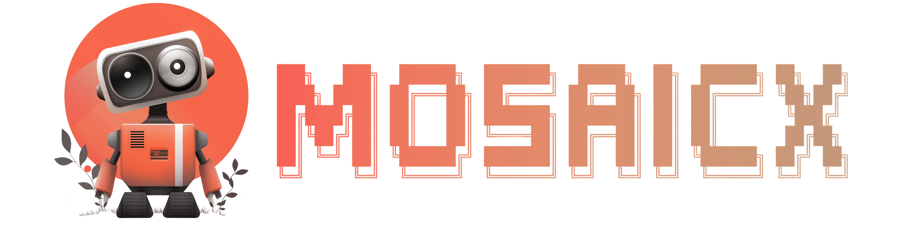
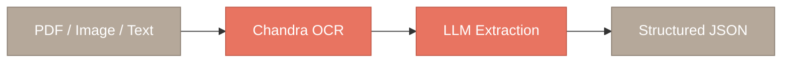

<div align="center">
  
</div>

<p align="center">
  <a href="https://pypi.org/project/mosaicx/"></a>
  <a href="https://doi.org/10.5281/zenodo.17601890"></a>
  <a href="https://www.python.org/downloads/"></a>
  <a href="https://www.apache.org/licenses/LICENSE-2.0"></a>
  <a href="https://pepy.tech/project/mosaicx"></a>
</p>

<p align="center">
  <strong><a href="https://www.linkedin.com/company/digitx-lmu/">DIGIT-X Lab</a> &middot; LMU Munich</strong><br>
  Turn unstructured medical documents into validated, machine-readable JSON.<br>
  Runs locally &mdash; no PHI leaves your machine.
</p>

---

## How It Works


```mermaid
flowchart LR
    A["PDF / Image / Text"] --> B["Chandra OCR"]
    B --> C["LLM Extraction"]
    C --> D["Structured JSON"]

    style A fill:#B5A89A,stroke:#8a7e72,color:#fff
    style B fill:#E87461,stroke:#c25a49,color:#fff
    style C fill:#E87461,stroke:#c25a49,color:#fff
    style D fill:#B5A89A,stroke:#8a7e72,color:#fff
```

MOSAICX converts medical documents (radiology reports, pathology summaries, clinical notes) into structured JSON. Define what to extract with a YAML template, point it at your documents, get clean data back. Every field comes with an excerpt citing the source text.

**Why MOSAICX?** Fully local (no PHI leaves your machine), schema-driven (you define exactly what to extract), VLM-powered OCR via [Chandra](https://github.com/datalab-to/chandra) (handles scans, handwriting, tables), and HIPAA-conformant de-identification built in.

## Prerequisites

MOSAICX needs two servers running: an **LLM** for extraction and **Chandra** for OCR.

### 1. LLM Server

We recommend **Gemma 4 31B** via **vLLM**:

**NVIDIA GPU:**

```bash
pip install vllm
vllm serve google/gemma-4-31B-it --port 8000
```

**Apple Silicon (Mac M1/M2/M3/M4):**

```bash
pip install vllm-mlx
vllm-mlx serve mlx-community/gemma-4-31b-it-bf16 --port 8000
```

### 2. OCR Server (for PDFs and images)

[Chandra](https://github.com/datalab-to/chandra) is a VLM-based OCR that handles handwriting, tables, and complex layouts. Run it as a vLLM server on a GPU:

```bash
pip install chandra-ocr
chandra_vllm --port 8001
```

> [!NOTE]
> Chandra is only needed for PDF/image documents. If you're extracting from `.txt` or `.md` files, you can skip this. Without Chandra, MOSAICX falls back to PaddleOCR automatically.

### Verify

```bash
curl -s http://localhost:8000/v1/models    # LLM server
```

> [!TIP]
> Any OpenAI-compatible LLM server works (Ollama, llama.cpp, SGLang). vLLM + Gemma 4 31B is what we test against.

## Install

```bash
python -m venv ~/.mosaicx-venv
source ~/.mosaicx-venv/bin/activate
pip install git+https://github.com/DIGIT-X-Lab/MOSAICX.git
```

With [uv](https://docs.astral.sh/uv/) (faster):

```bash
uv venv ~/.mosaicx-venv
source ~/.mosaicx-venv/bin/activate
uv pip install git+https://github.com/DIGIT-X-Lab/MOSAICX.git
```

Then create a `.env` file in your working directory:

```env
MOSAICX_LM=openai/google/gemma-4-31B-it
MOSAICX_API_BASE=http://localhost:8000/v1
MOSAICX_API_KEY=not-needed
MOSAICX_CHANDRA_SERVER_URL=http://localhost:8001/v1
```

MOSAICX reads this automatically. Check everything works:

```bash
mosaicx doctor
```

## Three Things You Can Do

### 1. Create a Template

Tell MOSAICX what to extract using natural language:

```bash
mosaicx template create --describe "chest CT with nodules, lung-rads score, and impression"
```

This generates a YAML template with typed fields (strings, numbers, enums, nested objects, lists). MOSAICX also ships with built-in templates:

```bash
mosaicx template list
```

### 2. Extract Structured Data

Single document:

```bash
mosaicx extract --document report.pdf --template chest_ct
```

Batch (parallel):

```bash
mosaicx extract --dir ./reports/ --template chest_ct --workers 8 --output-dir ./results/
```

Output is clean JSON with `{value, excerpt}` for every field:

```json
{
  "indication": {
    "value": "Follow-up pulmonary nodule",
    "excerpt": "Indication: Follow-up of incidentally detected pulmonary nodule"
  },
  "impression": {
    "value": "Stable 6mm nodule, recommend 12-month follow-up",
    "excerpt": "Impression: Stable 6mm solid nodule in right lower lobe"
  }
}
```

### 3. De-identify Documents

Remove PHI with HIPAA conformance (LLM + regex safety net):

```bash
mosaicx deidentify --document note.pdf
mosaicx deidentify --document note.pdf -o redacted.json
```

Batch:

```bash
mosaicx deidentify --dir ./notes/ --workers 4 --output-dir ./cleaned/
```

Output:

```json
{
  "conformance": "hipaa",
  "redacted_text": "Patient [REDACTED] presented with...",
  "phi": [
    {"value": "John Doe", "type": "NAME", "excerpt": "Patient John Doe presented"},
    {"value": "01/15/1990", "type": "DATE", "excerpt": "DOB: 01/15/1990"}
  ]
}
```

## Privacy

> [!IMPORTANT]
> **Data stays on your machine.** MOSAICX runs against a local LLM server -- no external API calls, no cloud uploads. De-identification follows HIPAA Safe Harbor rules by default.

## Configuration

All settings live in a `.env` file (recommended) or environment variables with the `MOSAICX_` prefix:

```env
MOSAICX_LM=openai/google/gemma-4-31B-it
MOSAICX_API_BASE=http://localhost:8000/v1
MOSAICX_API_KEY=not-needed
MOSAICX_OCR_ENGINE=chandra
MOSAICX_CHANDRA_SERVER_URL=http://localhost:8001/v1
```

```bash
# View active config
mosaicx config show
```

See [docs/configuration.md](docs/configuration.md) for the full reference.

## Documentation

| Guide | Description |
|-------|-------------|
| [Quickstart](docs/quickstart.md) | First successful run in ~10 minutes |
| [Getting Started](docs/getting-started.md) | Install, first extraction, basics |
| [CLI Reference](docs/cli-reference.md) | Every command, every flag, examples |
| [Schemas & Templates](docs/schemas-and-templates.md) | Create and manage extraction templates |
| [Configuration](docs/configuration.md) | Env vars, backends, OCR, export formats |
| [Developer Guide](docs/developer-guide.md) | Custom pipelines, Python SDK, MCP server |

## Development

```bash
git clone https://github.com/DIGIT-X-Lab/MOSAICX.git
cd MOSAICX
pip install -e ".[dev]"
pytest tests/ -q
```

## Citation

```bibtex
@software{mosaicx2025,
  title   = {MOSAICX: Medical cOmputational Suite for Advanced Intelligent eXtraction},
  author  = {Sundar, Lalith Kumar Shiyam and DIGIT-X Lab},
  year    = {2025},
  url     = {https://github.com/DIGIT-X-Lab/MOSAICX},
  doi     = {10.5281/zenodo.17601890}
}
```

## License

Apache 2.0 -- see [LICENSE](LICENSE).

## Contact

**Research:** [lalith.shiyam@med.uni-muenchen.de](mailto:lalith.shiyam@med.uni-muenchen.de) | **Commercial:** [lalith@zenta.solutions](mailto:lalith@zenta.solutions) | **Issues:** [github.com/DIGIT-X-Lab/MOSAICX/issues](https://github.com/DIGIT-X-Lab/MOSAICX/issues)
